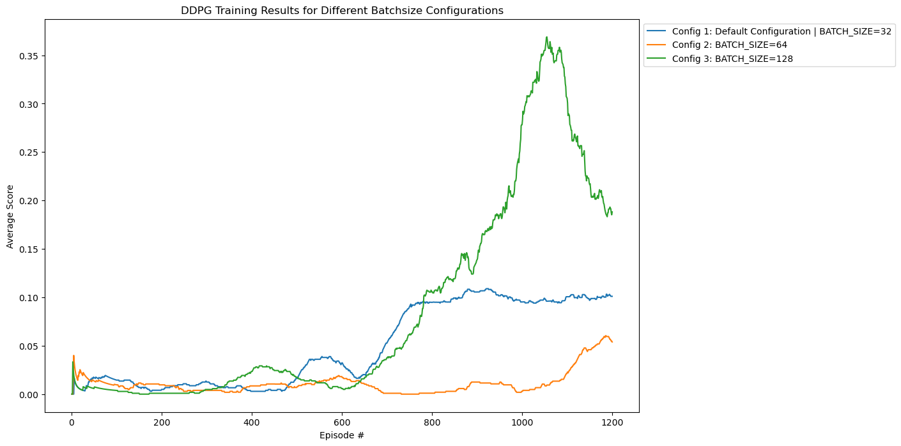
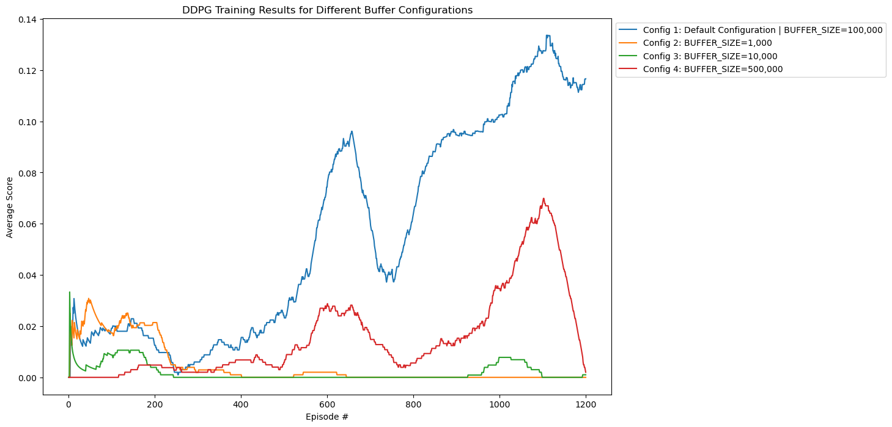

[//]: # (Image References)

# Agentic DR-Learning (Tennis)

## Learning Algorithm

In this project, we implement a Multi-Agent version of the DDPG (Deep Deterministic Policy Gradient) algorithm to solve the Tennis environment. The DDPG algorithm combines the advantages of value-based and policy-based methods, using four neural networks per agent: a Q network (the Critic), a policy network (the Actor), a target Q network, and a target policy network. In the Tennis environment, two agents (one per player) with seperate Replay Buffers are created.

### Actor Network

The Actor network maps states directly to actions, delivering the action to take (rather than a probability distribution), making it well-suited for environments with a continuous action space.

### Critic Network

The Critic network evaluates the quality of actions taken by the Actor, accelerating learning by providing feedback on the actions' effectiveness.

### Experience Replay

Experience replay is employed to store and sample past experiences (state, action, reward, next state, done tuples) to break the correlation between consecutive experiences. This is implemented in the `ReplayBuffer` class, which maintains a buffer of experiences and samples them randomly for training, ensuring that updates are based on uncorrelated experiences.

##### Noise Implementation

The Ornstein-Uhlenbeck process generates temporally correlated noise, suitable for exploration in continuous action spaces. The process is defined by the following parameters:
- `mu`: Mean of the noise
- `theta`: The rate of mean reversion
- `sigma`: The volatility parameter

This noise is added to the actions to ensure adequate exploration during training. The implementation details are encapsulated in the `OUNoise` class.

### Exploration Strategy

For environments with continuous action spaces, exploration is achieved by adding noise to the actions rather than selecting random actions.

### Soft Updates

The target networks' weights are slowly updated towards the actual networks' weights using soft updates, where the weights of the target networks are adjusted incrementally to match the actual networks' weights.

## Model Architecture

### Actor

- **Architecture**: 
  - Input Layer: State size
  - Hidden Layer 1: 256 neurons
  - Hidden Layer 2: 128 neurons
  - Output Layer: 4 values (action dimensions)
- **Activation Functions**: 
  - ReLU for hidden layers
  - Tanh for output layer

### Critic

- **Architecture**: 
  - Input Layer: State size
  - Hidden Layer 1: 256 neurons
  - Hidden Layer 2: 128 neurons
  - Output Layer: 1 value (Q-value)
- **Activation Functions**: 
  - ReLU for hidden layers
  - None for output layer

## Hyperparameters

- `BUFFER_SIZE`: 100.000
- `BATCH_SIZE`: 64
- `GAMMA`: 0.99
- `TAU`: 0.07
- `LR_ACTOR`: 0.0001
- `LR_CRITIC`: 0.001
- `mu`: 0
- `theta`: 0.15
- `sigma`: 0.2

## Training Results

### Different Batch & Buffer Sizes

  
  

### Different Hyperparameter Configurations

### Final Training Run

In the configuration the agents solved thetask in

The algorithm took 1040 episodes to solve the environment with an average score of 0.51 in one of the Tuning-runs.

## Tuning

To tune the hyperparemets, several configurations were tested for 1200 epsiodes to find the optimal settings for training the agents.

1. **Batch Size**:
   - Increasing the batch size from 32 to 128 showed improved average scores, with the highest average score of 0.19 achieved with a batch size of 128. However, the smaller batch size of 32 is generally more stable.

2. **Buffer Size**:
   - The buffer size of 100,000 yielded the best performance. Significantly smaller buffer sizes (1,000 and 10,000) resulted in poor performance, likely due to insufficient experience sampling.

3. **Tau (Soft Update Factor)**:
   - A higher tau value of 0.1 significantly improved performance, even solving the environment in 1040 episodes. This suggests that more aggressive updates to the target networks can be beneficial, especially in Multi-Agent settings.

4. **Learning Rates**:
   - Higher learning rates for the Critic and Actor networks generally resulted in poorer performance, indicating that more conservative learning rates help in stabilizing training.

5. **Network Architecture**:
   - Increasing the number of hidden units in the network architecture did not increase directly. However it's possible, that it raises the maximum capacity of intelligence of the network in the long run.

## Improvements

To further improve the efficiency of the agents, several strategies can be considered:

- **Shared Replay Buffers**: The Agents could share a Replay Buffer to increase performance.
- **Hyperparameter Tuning**: Experimenting with different sets of hyperparameters.
- **Alternative Algorithms**: Trying different algorithms like Proximal Policy Optimization.

